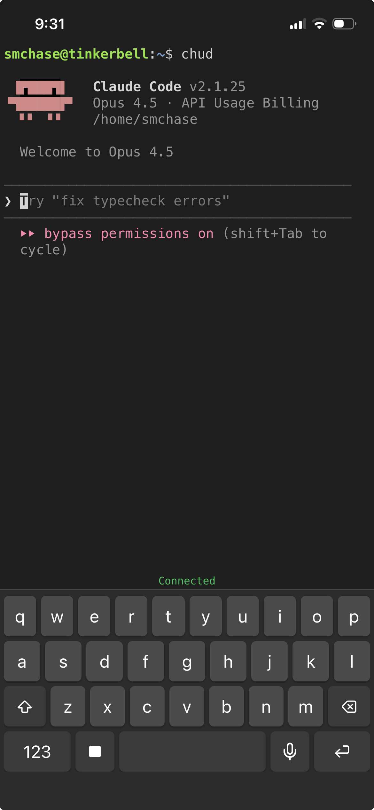

# claude-to-go

A mobile-friendly web terminal for using Claude Code from your phone. Features a custom on-screen keyboard, push-to-talk voice dictation, and optimized scrolling behavior for touchscreens.



## Features

- **Custom On-Screen Keyboard**: Full QWERTY with numbers/symbols layouts, key repeat support, and Ctrl+C for interrupts
- **Voice Dictation**: Hold the mic button to record, release to transcribe using Deepgram's Whisper large model with auto language detection
- **Mobile-Optimized Terminal**: Dynamic terminal growth with smooth touch scrolling that preserves your scroll position
- **Persistent Connections**: WebSocket-based terminal with auto-reconnect on connection loss

## Quick Start

```bash
# Install dependencies (requires Node 18+)
npm install

# Create .env file
cp .env.example .env
# Edit .env and add your DEEPGRAM_API_KEY

# Start the server
npm start
```

Access from your phone at the network URL displayed on startup (e.g., `http://192.168.1.x:3000`).

## Remote Access with Cloudflare Tunnel

For secure access from anywhere (not just your local network), set up a Cloudflare Tunnel:

### 1. Install cloudflared

```bash
# Debian/Ubuntu
curl -fsSL https://pkg.cloudflare.com/cloudflare-main.gpg | sudo tee /usr/share/keyrings/cloudflare-main.gpg >/dev/null
echo 'deb [signed-by=/usr/share/keyrings/cloudflare-main.gpg] https://pkg.cloudflare.com/cloudflared any main' | sudo tee /etc/apt/sources.list.d/cloudflared.list
sudo apt update && sudo apt install cloudflared
```

### 2. Authenticate and create tunnel

```bash
cloudflared tunnel login
cloudflared tunnel create claude-to-go
```

### 3. Configure the tunnel

Create `~/.cloudflared/config.yml`:

```yaml
tunnel: <your-tunnel-id>
credentials-file: /home/<user>/.cloudflared/<tunnel-id>.json

ingress:
  - hostname: claude.yourdomain.com
    service: http://localhost:3000
  - service: http_status:404
```

### 4. Add DNS record

```bash
cloudflared tunnel route dns claude-to-go claude.yourdomain.com
```

### 5. Run as a service

```bash
sudo cloudflared service install
sudo systemctl start cloudflared
```

### Securing with Cloudflare Access

Protect your terminal with Cloudflare Access (recommended):

1. Go to Cloudflare Zero Trust dashboard
2. Navigate to Access > Applications > Add an application
3. Select "Self-hosted" and enter your tunnel hostname
4. Configure an access policy (e.g., email OTP, GitHub auth, etc.)

This ensures only you can access your terminal, even though it's exposed to the internet.

## Running as a System Service

Edit `claude-to-go.service` and update the paths for your system, then:

```bash
sudo cp claude-to-go.service /etc/systemd/system/
sudo systemctl daemon-reload
sudo systemctl enable claude-to-go
sudo systemctl start claude-to-go
```

## Environment Variables

| Variable | Description | Default |
|----------|-------------|---------|
| `DEEPGRAM_API_KEY` | API key for voice transcription | (required for voice) |
| `PORT` | Server port | 3000 |

## How It Works

- **Terminal**: xterm.js connects via WebSocket to a node-pty shell process
- **Keyboard**: simple-keyboard with custom layouts; bypasses iOS system keyboard
- **Scrolling**: Terminal grows dynamically while preserving scroll position
- **Voice**: Records WebM audio, sends to Deepgram API, injects transcript as terminal input
